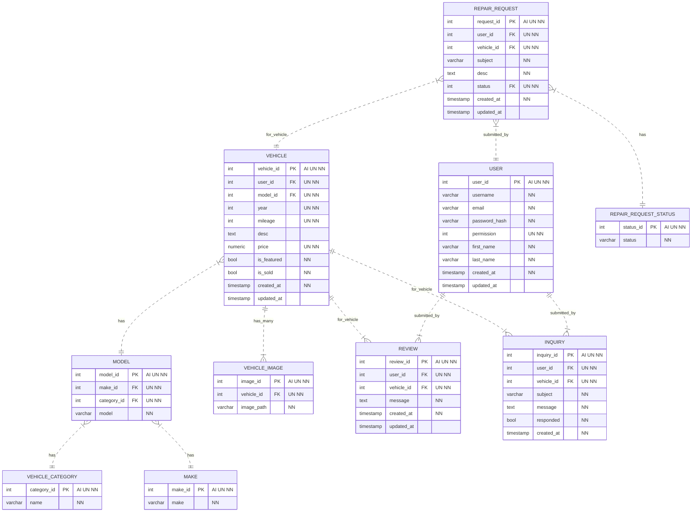

```mermaid

erDiagram
    USER {
        int user_id PK "AI UN NN"
        varchar username "NN"
        varchar email "NN"
        varchar password_hash "NN"
        int permission "UN NN"
        varchar first_name "NN"
        varchar last_name "NN"
        timestamp created_at "NN"
        timestamp updated_at
    }


    VEHICLE_CATEGORY {
        int category_id PK "AI UN NN"
        varchar name "NN"
    }
    VEHICLE {
        int vehicle_id PK "AI UN NN"
        int user_id FK "UN NN"
        int model_id FK "UN NN"
        int year "UN NN"
        int mileage "UN NN"
        text desc
        numeric price "UN NN"
        bool is_featured "NN"
        bool is_sold "NN"
        timestamp created_at "NN"
        timestamp updated_at
    }
    MAKE {
        int make_id PK "AI UN NN"
        varchar make "NN"
    }
    MODEL {
        int model_id PK "AI UN NN"
        int make_id FK "UN NN"
        int category_id FK "UN NN"
        varchar model "NN"
    }
    VEHICLE_IMAGE {
        int image_id PK "AI UN NN"
        int vehicle_id FK "UN NN"
        varchar image_path "NN"
    }


    REVIEW {
        int review_id PK "AI UN NN"
        int user_id FK "UN NN"
        int vehicle_id FK "UN NN"
        text message "NN"
        timestamp created_at "NN"
        timestamp updated_at
    }
    INQUIRY {
        int inquiry_id PK "AI UN NN"
        int user_id FK "UN NN"
        int vehicle_id FK "UN NN"
        varchar subject "NN"
        text message "NN"
        bool responded "NN"
        timestamp created_at "NN"
    }
    REPAIR_REQUEST {
        int request_id PK "AI UN NN"
        int user_id FK "UN NN"
        int vehicle_id FK "UN NN"
        varchar subject "NN"
        text desc "NN"
        int status FK "UN NN"
        timestamp created_at "NN"
        timestamp updated_at
    }
    REPAIR_REQUEST_STATUS {
        int status_id PK "AI UN NN"
        varchar status "NN"
    }

    VEHICLE }|..|| MODEL : has
    MODEL }|..|| VEHICLE_CATEGORY : has
    MODEL }|..|| MAKE : has
    VEHICLE ||..|{ VEHICLE_IMAGE : has_many

    USER ||..|{ REVIEW: submitted_by
    VEHICLE ||..|{ REVIEW : for_vehicle

    REPAIR_REQUEST }|..|| USER : submitted_by
    REPAIR_REQUEST }|..|| VEHICLE : for_vehicle
    REPAIR_REQUEST }|..|| REPAIR_REQUEST_STATUS : has

    USER ||..|{ INQUIRY : submitted_by
    VEHICLE ||..|{ INQUIRY : for_vehicle
    

```